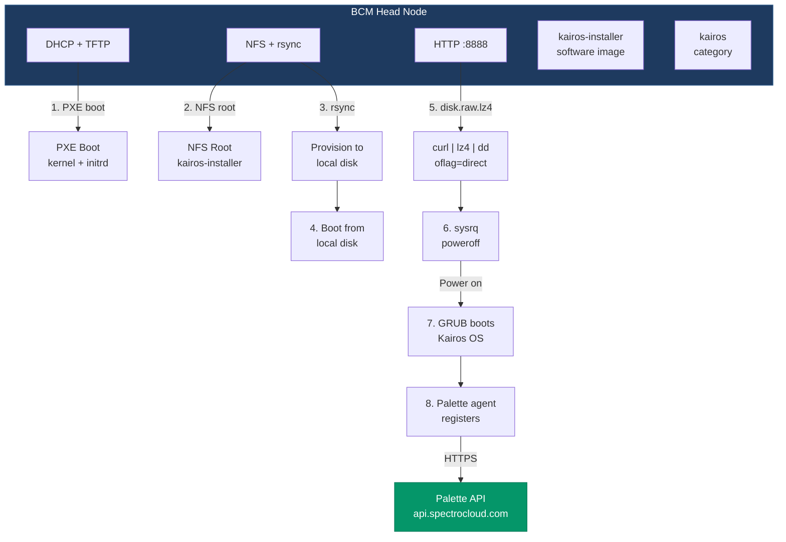

# Kairos Edge Deployment on BCM — POC

## Executive Summary

We propose deploying Spectro Cloud's Kairos OS to bare-metal compute nodes using your existing Bright Cluster Manager (BCM) infrastructure. The solution leverages BCM's native PXE provisioning pipeline to deliver a pre-built, immutable Kairos disk image to physical servers. We add a new software image, category, and node registrations to BCM — all additive changes that don't touch your existing images or node configurations. No additional infrastructure is required beyond what BCM already provides.

The entire deployment is automated via Ansible and requires approximately 60 minutes of build time (one-time) plus 10-15 minutes per node provisioning.

---

## Why This Approach

### The Problem

Kairos and BCM use fundamentally different installation processes. BCM provisions nodes through its own PXE pipeline — DHCP, TFTP, NFS root, rsync — tightly integrated with its cluster management daemon (`cmd`). Kairos, on the other hand, expects to be installed from an ISO or its own PXE environment using `kairos-agent install`, which partitions the disk with a specific immutable layout (COS_STATE, COS_OEM, COS_RECOVERY, COS_PERSISTENT).

These two approaches are incompatible out of the box:

- BCM's provisioning writes a traditional Linux root filesystem to the node's disk via rsync
- Kairos requires a specific partition layout with squashfs images, an EFI/BIOS bootloader, and an OEM config partition
- Running `kairos-agent install` inside BCM's provisioning pipeline isn't possible — kairos-agent expects to boot from its own ISO

The typical alternatives are:

- **Manual USB/ISO installation** per node — doesn't scale
- **Custom PXE infrastructure** separate from BCM — duplicates what BCM already does, requires separate DHCP/TFTP, creates network conflicts
- **Replacing BCM entirely** — loses HPC cluster management capabilities

None of these are acceptable in a production environment where BCM is already managing infrastructure.

### Our Solution

We inject Kairos into BCM's existing provisioning pipeline. BCM already knows how to PXE boot nodes, rsync software images, and manage node lifecycle. We create a custom BCM software image (`kairos-installer`) that, instead of installing a traditional HPC OS, writes a pre-built Kairos raw disk image directly to the node's primary disk using `dd`. The node reboots into a fully configured Kairos OS with the Palette agent registered and ready for cluster assignment.

### Why This Is Better

1. **Leverages existing infrastructure** — builds on your existing BCM DHCP, TFTP, NFS, and rsync pipeline. No new servers or network changes required.
2. **Additive, not destructive** — all changes to BCM are additions (new software image, new category, new node registrations). Existing images, categories, and nodes are untouched.
3. **Single control plane** — BCM manages both traditional HPC nodes and Kairos nodes. Switching a node between HPC and Kairos is a category change in cmsh.
4. **Repeatable** — the Kairos image is built once, deployed to any number of nodes
5. **Immutable** — Kairos boots from a read-only squashfs root, immune to configuration drift
6. **Reversible** — re-categorize a node in BCM to restore it to a standard HPC image

---

## Prerequisites

### What We Need From You

| Requirement | Detail |
|-------------|--------|
| **BCM head node** | Running BCM 11.0, accessible via SSH with root credentials |
| **BCM services** | `cmd`, `dhcpd`, `named`, `nfs-server` all active and provisioning working |
| **Network** | Internal provisioning network (BCM eth0) and external management network (BCM eth1) on separate subnets |
| **DNS forwarding** | BCM's `named` must forward to an upstream DNS server for external resolution (we configure this) |
| **Compute node** | At least one bare-metal server connected to the provisioning network, configured to PXE boot |
| **Node MAC address** | MAC of the compute node's provisioning NIC (we register it in BCM) |
| **Internet access** | BCM must reach the internet for Palette agent registration (HTTPS to `api.spectrocloud.com`) |
| **Palette credentials** | Palette API endpoint, registration token, and project UID |

### What We Provide

| Component | Detail |
|-----------|--------|
| **Kairos raw disk image** | 80 GB sparse image (actual ~9 GB), pre-built with Kairos OS + K3s + Palette agent |
| **Installer scripts** | `install-kairos.sh` — runs inside BCM's provisioning to dd the image to disk |
| **Deployment automation** | Ansible playbooks that configure BCM and register compute nodes |
| **Validation suite** | 41-point automated validation covering BCM services, networking, Kairos OS, and Palette registration |

---

## Architecture



### What Changes in BCM

We SSH to the BCM head node and make the following changes directly via `cmsh` and the filesystem:

1. **Software image**: `kairos-installer` — cloned from `default-image`, with `install-kairos.sh` script and `kairos-install.service` injected into the image filesystem, `lz4` binary copied in, eth0/ens3 DHCP added to network interfaces, ramdisk regenerated
2. **Category**: `kairos` — new category created in cmsh, set to FULL install mode with `kairos-installer` image and custom kernel parameters
3. **Node registration**: each compute node registered in cmsh with its MAC address, assigned to the `kairos` category with an explicit IP
4. **DNS forwarders**: `partition base; set nameservers` configured via cmsh so compute nodes can resolve external names through BCM's named
5. **IP forwarding + NAT**: enabled on the head node if both NICs share a subnet, so compute nodes can reach the internet through BCM
6. **HTTP server**: systemd service created to serve the Kairos raw image on port 8888 from `/cm/shared/kairos/`
7. **Kairos image upload**: `disk.raw.lz4` (~5.6 GB) uploaded to `/cm/shared/kairos/` on the BCM filesystem

### What Happens During Provisioning

The node PXE boots exactly as it would for any BCM-managed node. The only difference is the software image it receives.

| Phase | Time | What Happens |
|-------|------|--------------|
| PXE boot | ~30s | DHCP → TFTP (kernel + initrd) → NFS root from `kairos-installer` |
| Provisioning | ~5 min | BCM rsyncs `kairos-installer` image to local disk (~10 GB) |
| Switch to local root | ~30s | Node boots from local disk, systemd starts |
| Kairos dd | ~3 min | `curl` downloads lz4-compressed image from BCM HTTP server, `lz4 -d` decompresses, `dd` writes to disk with `oflag=direct` |
| Poweroff | instant | `sysrq` poweroff from RAM (disk was overwritten during dd) |
| Kairos boot | ~2 min | Power on → GRUB loads Kairos → Palette agent starts → node registers |
| **Total** | **~12 min** | From PXE boot to Palette-registered Kairos node |

---

## Implementation Steps

### Step 1: Build Kairos Image (`make kairos-build`)

**What**: Builds a bootable 80 GB raw disk image containing Kairos OS, K3s, and the Palette edge agent.

**Where it runs**: On the build host (your workstation or CI server). Does not touch BCM.

#### Build Process

**Phase 1 — CanvOS ISO build** (Earthly + Docker):

1. Clones the `CanvOS/` submodule (Spectro Cloud's Kairos builder)
2. Generates `.arg` file with build parameters (OS base, kernel version, registry)
3. Copies overlay files into the build context: network config, BCM compatibility scripts, systemd services
4. Patches the Earthfile to add required packages (`wget`, `ifupdown`, `nfs-common`)
5. Runs `earthly.sh +iso` inside Docker — produces the Palette Edge Installer ISO

**Phase 2 — Raw disk image creation** (headless QEMU):

1. Generates an ED25519 SSH keypair for BCM-to-Kairos communication
2. Renders `cloud-config.yaml` from template with Palette credentials, SSH keys, boot scripts, and user configuration
3. Creates a FAT32 user-data image (4 MB) with the cloud-config (mounted as CIDATA in QEMU)
4. Creates a blank 80 GB sparse raw disk via `truncate -s 81920M`
5. Boots a headless QEMU VM (SeaBIOS, 4 GB RAM, 2 CPUs) from the CanvOS ISO
6. Inside QEMU: mounts user-data, copies cloud-config to `/oem/`, runs `kairos-agent --debug install`
7. kairos-agent partitions the disk: vda1 (EFI 100M), vda2 (COS_OEM), vda3 (COS_RECOVERY), vda4 (COS_STATE), vda5 (COS_PERSISTENT), installs GRUB-pc to MBR
8. VM powers off when install completes

**Phase 3 — Post-processing**:

1. Fixes ext4 `metadata_csum` on each partition (GRUB compatibility)
2. Patches `bootargs.cfg` in each squashfs image: `net.ifnames=0 biosdevname=0` for classic NIC naming
3. Sparse-trims the raw disk with `fallocate --dig-holes` (80 GB virtual → ~9 GB actual on disk)

#### Build Host Requirements

| Requirement | Detail |
|-------------|--------|
| **Docker** | Running and accessible (user in `docker` group). Docker CE or docker.io. |
| **QEMU/KVM** | `qemu-system-x86_64` with KVM acceleration (`/dev/kvm` accessible) |
| **Disk space** | ~20 GB free for build artifacts (ISO + raw image + intermediate files) |
| **RAM** | 4 GB free for the QEMU build VM |
| **Tools** | `xorriso`, `cpio`, `mtools`, `dosfstools`, `e2fsprogs`, `lz4` |
| **Network** | Internet access to pull Docker images and OS packages during CanvOS build |
| **CanvOS submodule** | `git submodule update --init --recursive` must be run first |

#### Configuration Required

All variables in `inventory/group_vars/all`:

| Variable | Purpose | How to obtain |
|----------|---------|---------------|
| `palette_endpoint` | Palette API URL | From your Palette account settings |
| `palette_token` | Palette edge registration token | Palette UI → Settings → Registration Tokens |
| `palette_project_uid` | Palette project ID | Palette UI → Project Settings → ID |
| `kairos_kernel_version` | Kernel version baked into the image | Must match the CanvOS base OS (e.g., `6.8.0-87-generic` for Ubuntu 22.04) |
| `kairos_container_registry` | Container registry for CanvOS push | `ttl.sh` for ephemeral testing, your private registry for production |
| `bcm_password` | BCM root password (for SSH keypair) | Provided by your BCM admin |

#### Output

| Artifact | Size | Description |
|----------|------|-------------|
| `build/kairos-disk.raw` | ~9 GB on disk (80 GB virtual) | Bootable raw disk image with Kairos + GRUB-pc MBR |
| `build/palette-edge-installer.iso` | ~2 GB | CanvOS installer ISO (intermediate, used by QEMU) |
| `build/cloud-config.yaml` | ~2 KB | Rendered cloud-config with Palette credentials |
| `build/bcm-kairos-key` | ED25519 keypair | SSH key for BCM ↔ Kairos communication |

**Time**: 45-90 minutes (Docker build ~30 min + QEMU install ~15 min + post-processing ~5 min). One-time build — the same image deploys to all nodes.

---

### Step 2: Deploy to BCM (`make deploy-dd`)

**What**: Uploads the Kairos image to BCM, creates the installer software image, configures PXE provisioning, and registers compute nodes.

**Where it runs**: On the build host. SSHs to BCM to make all changes.

#### BCM Access Requirements

| Requirement | Detail |
|-------------|--------|
| **SSH access** | Root SSH to the BCM head node from the build host |
| **sshpass** | Installed on the build host (for non-interactive SSH) |
| **Network** | Build host must reach `bcm_connect_ip` on port 22 |
| **BCM services** | `cmd` must be active before this step runs. The script waits up to 5 minutes for `cmd` to start. |
| **Disk space on BCM** | ~6 GB free in `/cm/shared/` for the compressed image |
| **`default-image`** | BCM must have a `default-image` software image to clone from (standard BCM installation includes this) |

#### What It Does (7 automated steps)

**[1/7] Compress and upload**

- Compresses the raw image on the build host: `lz4 -f build/kairos-disk.raw build/kairos-disk.raw.lz4` (80 GB → ~5.6 GB)
- Creates `/cm/shared/kairos/` on BCM via SSH
- Uploads via `scp` to `root@<bcm>:/cm/shared/kairos/disk.raw.lz4`

**[2/7] HTTP server**

- Creates `/etc/systemd/system/kairos-http.service` on BCM: `python3 -m http.server 8888 --directory /cm/shared/kairos`
- Enables and starts the service
- Compute nodes will download the image from `http://<bcm-internal-ip>:8888/disk.raw.lz4` during provisioning

**[3/7] Create installer software image**

- Via `cmsh`: clones `default-image` → `kairos-installer`
- If `kairos-installer` already exists, reuses it
- This creates a full copy of the default image filesystem at `/cm/images/kairos-installer/`

**[4/7] Install dd service into the image**

- Installs `lz4` on the BCM host (sets DNS to upstream forwarder first if needed, runs `apt-get install lz4`)
- Copies the `lz4` binary into the chroot: `/cm/images/kairos-installer/usr/local/bin/lz4`
- Copies `install-kairos.sh` to `/cm/images/kairos-installer/usr/local/sbin/install-kairos.sh`
- Creates `kairos-install.service` systemd oneshot unit (10-second delay, then runs `install-kairos.sh`)
- Enables the service in the image
- Adds DHCP config for both `eth0` and `ens3` to the image's `/etc/network/interfaces`. This is critical — without it, the node loses network after switching to local root and the dd can't download the image.

**[5/7] Create kairos category**

- Via `cmsh`: creates `kairos` category with `softwareimage=kairos-installer`, `installmode=FULL`, and kernel parameters `console=ttyS0,115200n8 net.ifnames=0 biosdevname=0`
- `FULL` install mode tells BCM to rsync the entire image to the node's local disk
- `net.ifnames=0 biosdevname=0` ensures classic NIC naming (`eth0`, not `ens3`) in the Kairos OS after dd

**[6/7] Register compute node**

- Removes any existing `node001` registration (to ensure clean IP assignment)
- Adds new registration via `cmsh`: `add physicalnode node001 <ip> eth0`, sets `category kairos`, sets `mac <compute-node-mac>`
- The IP is explicitly set to `<bcm-internal-subnet>.10` to avoid BCM auto-assigning the gateway IP (BCM assigns `base+1` by default, which is typically `.1` — often the gateway)

**[7/7] Regenerate ramdisk**

- Via `cmsh`: `softwareimage; use kairos-installer; createramdisk -w`
- This rebuilds the PXE initrd for the `kairos-installer` image so TFTP can serve it to booting nodes
- Takes 5-10 minutes

**Additional BCM configuration applied automatically**:

- **DNS forwarders**: `cmsh partition; use base; set nameservers <dns-ip>; commit` — configures BCM's `named` to forward external queries. This persists across `named` restarts because it's set through `cmsh`, not by editing `named.conf` directly (BCM regenerates `named.conf` from its config database).
- **IP forwarding + NAT**: if `bcm_internal_bridge == bcm_external_bridge` (single-bridge topology), enables `net.ipv4.ip_forward=1` and `iptables -t nat POSTROUTING -o eth1 -j MASQUERADE` so compute nodes can reach the internet through BCM.

<div class="page-break"></div>

#### Configuration Required

All variables in `inventory/group_vars/all`:

| Variable | Purpose | How to obtain |
|----------|---------|---------------|
| `bcm_connect_ip` | BCM IP reachable from the build host | BCM admin — this is the IP you SSH to |
| `bcm_password` | BCM root password | BCM admin |
| `bcm_internal_ip` | BCM internal/provisioning network IP (eth0) | `ip addr show eth0` on BCM, or BCM admin |
| `bcm_internal_cidr` | Provisioning subnet in CIDR notation | e.g., `10.0.1.0/24` — matches your provisioning network |
| `bcm_external_gateway` | Default gateway for the external network | `ip route` on BCM, or network admin |
| `bcm_external_dns` | Upstream DNS server | Network admin — the DNS server BCM should forward to |
| `bcm_internal_bridge` | Proxmox bridge for internal NIC | Only relevant for Proxmox VMs, not bare-metal LXD |
| `bcm_external_bridge` | Proxmox bridge for external NIC | Only relevant for Proxmox VMs, not bare-metal LXD |
| `kairos_vm_mac` | MAC address of the compute node's provisioning NIC | `ip link` on the compute node, or from the NIC label/BIOS |

#### Output

Changes made to BCM (persistent):

- `/cm/shared/kairos/disk.raw.lz4` — compressed Kairos image
- `/cm/images/kairos-installer/` — modified software image with dd installer
- `/etc/systemd/system/kairos-http.service` — HTTP server for image delivery
- `cmsh` objects: `kairos-installer` image, `kairos` category, `node001` registration, DNS forwarders

**Time**: ~10 minutes (lz4 compression ~2 min, scp upload ~3 min, ramdisk regeneration ~5 min)

---

### Step 3: PXE Boot Compute Node

**What**: Power on the bare-metal compute node. BCM provisions it, the dd installer writes Kairos, the node powers off, then boots into Kairos.

#### Physical Requirements

| Requirement | Detail |
|-------------|--------|
| **Compute node** | Bare-metal server with at least one NIC on the BCM provisioning network |
| **BIOS boot order** | PXE boot must be first (or only) boot option |
| **Disk** | At least 80 GB on the primary disk (the dd writes an 80 GB image) |
| **MAC registered** | The node's provisioning NIC MAC must be registered in BCM (done in Step 2) |
| **Power control** | IPMI, manual power button, or BCM power management |

#### Boot Sequence (fully automated after power-on)

**Phase 1: PXE Boot (~30 seconds)**
1. Node powers on, BIOS attempts PXE boot
2. NIC sends DHCP DISCOVER on the provisioning network
3. BCM's `dhcpd` recognizes the MAC, offers an IP from the registered node config
4. TFTP serves the kernel (`vmlinuz`) and initrd from the `kairos-installer` image
5. Kernel boots, mounts NFS root from BCM

**Phase 2: BCM Provisioning (~5 minutes)**
6. BCM's node installer starts — you'll see the "Cluster Manager Node Installer" TUI on the console
7. Install mode is FULL — BCM rsyncs the entire `kairos-installer` image to the node's local disk
8. The node creates partitions, formats XFS on the root partition, rsyncs ~10 GB of data

**Phase 3: Switch to Local Root (~30 seconds)**
9. BCM's `callinginit` phase: the node pivots from NFS root to the local disk
10. systemd starts on the local disk
11. Networking comes up via DHCP (the eth0/ens3 config we added to the image)
12. Node gets an IP and can reach BCM's HTTP server on port 8888

**Phase 4: Kairos DD Install (~3 minutes)**
13. `kairos-install.service` starts (with a 10-second delay for networking to settle)
14. `install-kairos.sh` runs:
    - Detects the target disk (`/dev/sda` or `/dev/vda` — first non-floppy block device)
    - Waits for BCM's HTTP server to be reachable (retries up to 60 times, 10s apart)
    - Stages binaries to RAM (`/dev/shm/kinstall/`): `bash`, `curl`, `lz4`, `dd`, `sync`, `sleep`, `sgdisk` + all shared libraries
    - Enables sysrq: `echo 1 > /proc/sys/kernel/sysrq`
    - Execs into a staged bash script in RAM that runs:
      ```
      curl --fail -s http://<bcm-ip>:8888/disk.raw.lz4 | lz4 -d - - | dd of=/dev/sda bs=4M oflag=direct
      sgdisk -e /dev/sda        # fix GPT backup header
      echo 3 > /proc/sys/vm/drop_caches
      sync
      echo o > /proc/sysrq-trigger   # poweroff from RAM
      ```
    - `oflag=direct` is critical — it bypasses the page cache so LVM thin pools only allocate blocks for actual non-zero data
    - The entire script runs from RAM because `dd` is actively overwriting the disk the OS booted from

**Phase 5: Poweroff**
15. `echo o > /proc/sysrq-trigger` triggers an immediate poweroff
16. The node is now off with a fully written Kairos disk

**Phase 6: Boot Kairos (~2 minutes)**
17. **Power on the node** (manual, IPMI, or automation)
18. BIOS boots from disk — GRUB-pc in MBR loads Kairos
19. Kairos `immucore` init runs: mounts squashfs root (read-only), overlay, OEM config
20. Cloud-config applies: sets hostname, configures SSH keys, starts Palette agent
21. `stylus-agent` registers the node with Palette as an edge host
22. Node is ready for cluster assignment in the Palette UI

#### Monitoring Progress

**From BCM** (`cmsh -c "device; use node001; status"`):

| BCM Status | Phase | Duration |
|------------|-------|----------|
| `BOOTING` (ldlinux.c32 from bcm-head) | PXE boot, TFTP loading | ~30s |
| `INSTALLING` (provisioning started) | rsync to local disk | ~5 min |
| `INSTALLING` (provisioning completed) | rsync done | — |
| `INSTALLER_CALLINGINIT` (switching to local root) | pivot to local disk | ~30s |
| `UP` | local root booted, dd running | ~3 min |
| `DOWN` | node powered off (dd complete) | — |

**From BCM DHCP logs** (`journalctl -u dhcpd`):

- Verify the node got the correct IP (not the gateway)
- Verify DHCPACK, not DHCPNAK

**After powering back on**: BCM shows node as `DOWN` — this is expected. The node is now running Kairos, not the BCM installer. Kairos doesn't report status back to BCM. Management is through Palette from this point.

#### Configuration Required

None beyond Step 2. The node just needs to PXE boot from the provisioning network.

**Time**: ~12 minutes from first power-on to Palette-registered Kairos node (including the manual power cycle after dd)

---

### Step 4: Validate (`make validate`)

**What**: Runs a comprehensive 41-point validation across BCM and the Kairos node.

**How**: An automated bash script SSHs to BCM, then jumps to the Kairos node, and verifies every component of the deployment.

#### BCM Validation (21 checks)

| Category | What We Check |
|----------|---------------|
| Connectivity | SSH access to BCM, ping |
| Services | `cmd` (BCM daemon), `dhcpd`, `named` (DNS), `nfs-server`, `rsyncd` (port 873), HTTP image server (port 8888) |
| Network | eth0 IP matches expected internal IP, eth1 IP matches expected external IP, default gateway correct |
| DNS | External name resolution works (google.com), internet access (HTTPS 301) |
| Cluster | Head node UP in cmsh, compute node registered, node IP correct, category is `kairos`, `kairos-installer` image exists, raw image file exists on disk |

#### Kairos Node Validation (20 checks)

| Category | What We Check |
|----------|---------------|
| Connectivity | SSH to Kairos node (via BCM jump host), ping |
| OS | Ubuntu 22.04 base, Kairos release version, kairos-agent version, kernel version |
| Network | IP address assigned, default gateway set, DNS resolver configured, external DNS resolution, internet access |
| Services | `stylus-agent` (Palette agent) running, Palette registration logged |
| Boot | `net.ifnames=0` in kernel cmdline (classic NIC naming), Kairos boot chain (`rd.cos`) active |
| Disk | COS_OEM, COS_RECOVERY, COS_STATE, COS_PERSISTENT partition labels present, root filesystem mounted read-only (immutable), free disk space |
| Config | OEM yaml configuration files present in `/oem/` |

#### Output

```
============================================
 E2E Deployment Validation
============================================

== BCM Head Node (10.x.x.x) ==

-- Connectivity --
  [PASS] BCM SSH
  [PASS] BCM ping

-- BCM Services --
  [PASS] cmd service
  [PASS] dhcpd
  [PASS] named (DNS)
  [PASS] nfs-server
  [PASS] rsyncd (873)
  [PASS] HTTP server (8888) — Kairos image server
  ...

== Kairos Compute Node ==

-- OS --
  [PASS] OS — Ubuntu 22.04.5 LTS
  [PASS] Kairos release — "v4.0.3"
  [PASS] kairos-agent — v2.27.0
  [PASS] Kernel — 6.8.0-106-generic
  ...

============================================
 PASS: 41/41  WARN: 0/41  FAIL: 0/41
============================================
```

Any `[FAIL]` results in a non-zero exit code. `[WARN]` results include descriptions explaining the expected behavior and likely cause.

**Time**: ~2 minutes

---

## Scaling to Multiple Nodes

After the initial setup, adding more nodes is trivial:

```bash
# Register additional nodes in BCM (via cmsh or automation)
cmsh -c "device; add physicalnode node002 <ip> eth0; set category kairos; set mac <mac>; commit"
cmsh -c "device; add physicalnode node003 <ip> eth0; set category kairos; set mac <mac>; commit"
```

Then power on the nodes. Each one PXE boots, gets provisioned with the same `kairos-installer` image, runs the dd, and boots into Kairos. No rebuild needed — the same image serves all nodes.

---

## Rollback

To return a node to standard BCM management:

```bash
# In cmsh, change the category back to default
cmsh -c "device; use node001; set category default; set installmode FULL; commit"
```

Power cycle the node. BCM provisions the default HPC image instead of the Kairos installer. The node is back to standard BCM management.

---

## Risk Mitigation

| Risk | Mitigation |
|------|------------|
| dd overwrites the wrong disk | `install-kairos.sh` auto-detects the first non-floppy block device; in bare-metal this is deterministic |
| BCM provisioning fails | The node stays on NFS root — no data loss. Power cycle to retry. |
| Kairos image corrupt | Validation catches this (OS checks, partition checks, service checks). Rebuild image and re-run `deploy-dd`. |
| Palette agent doesn't register | Validate checks for registration log entries. Verify internet access and Palette credentials. |
| Node doesn't PXE boot | Verify BIOS boot order, check BCM DHCP logs (`journalctl -u dhcpd`), confirm MAC is registered |
| Thin pool overflow (virtual env only) | Only applies to Proxmox testbed deployments. Bare-metal with direct disk access has no thin pool. |

---

## Deliverables

1. **Ansible automation** — `make kairos-build`, `make deploy-dd`, `make validate` targets
2. **Kairos raw disk image** — pre-built, tested, with Palette agent configured
3. **BCM configuration** — `kairos-installer` software image, `kairos` category, node registrations
4. **Validation suite** — 41-point automated check covering BCM + Kairos + networking + Palette
5. **Documentation** — E2E quickstart guide, architecture reference, this POC document
